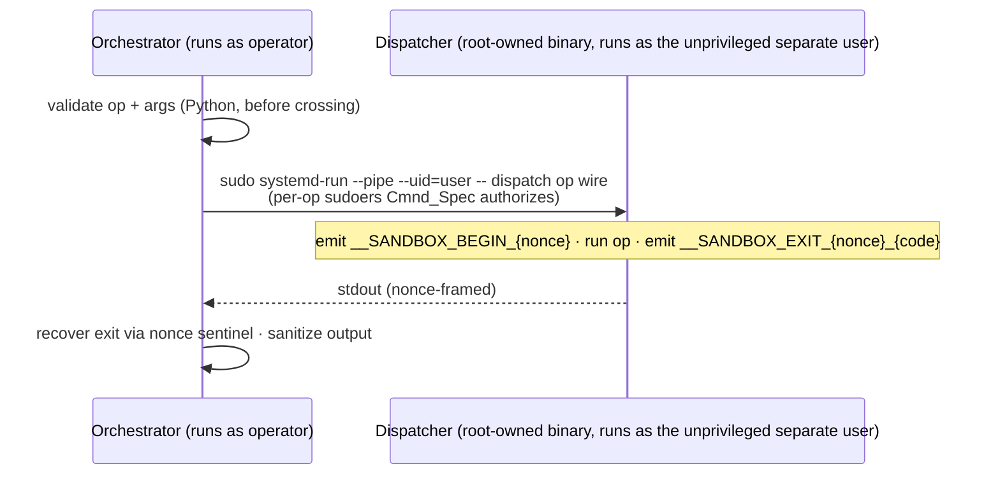

# Privilege boundary (two modes)

This document describes both execution modes and is explicit about which mechanism
is the default. The isolation rests on two layers:

- **Foundation (both modes).** `sandbox-ai` runs the Docker daemon **rootless** in
  both of its execution modes — a container escape that reaches the daemon lands on
  an *unprivileged* uid, never host root. That rootless-daemon isolation is the
  load-bearing foundation and holds regardless of mode.
- **Increment (hardened mode only).** The privilege *boundary* described in this
  document — a crossing into a dedicated, dead-end systemd user via a root-owned
  dispatcher — is an **increment on top of that foundation**, present only in the
  opt-in hardened mode.

## Contents

- [The two execution modes](#the-two-execution-modes)
  - [The operator-rootless tradeoff](#the-operator-rootless-tradeoff)
- [The separate-user privilege boundary](#the-separate-user-privilege-boundary)
  - [The dispatcher op surface — 12 ops](#the-dispatcher-op-surface--12-ops)
- [Binary-location split (load-bearing trust boundary)](#binary-location-split-load-bearing-trust-boundary)
- [Boundary primitives](#boundary-primitives)
  - [Why `sudo systemd-run --pipe` for separate-user ops (not `machinectl shell`)](#why-sudo-systemd-run---pipe-for-separate-user-ops-not-machinectl-shell)
  - [The `attach` ProxyCommand and the streaming `fwd` op](#the-attach-proxycommand-and-the-streaming-fwd-op)
  - [Setuid exception — `sudo_as_operator(operator)`](#setuid-exception--sudo_as_operatoroperator)
  - [PTY consequence (`machinectl_cmd` only)](#pty-consequence-machinectl_cmd-only)
- [The privilege-boundary crossing sequence (separate-user only)](#the-privilege-boundary-crossing-sequence-separate-user-only)

## The two execution modes

There are exactly two execution modes, selected at `sudo sandbox setup` time (the
mode is **not** a user-editable config field; it is setup-determined
and recorded in a root-owned per-operator marker):

- **`operator-rootless` — the default.** Rootless Docker runs as the **invoking
  operator's own user**. Orchestrator→daemon operations run as **local
  subprocesses with no boundary crossing**. This is the right fit for the common
  case: a single-operator developer box.
- **`separate-user` — opt-in hardened.** Rootless Docker runs as a **dedicated,
  unprivileged `docker_unprivileged_user`** (a dead-end account with no access to
  the operator's home, keys, or repos). Every orchestrator→daemon operation
  **crosses a privilege boundary** into that user via a root-owned Go dispatcher.
  This is the mode for adversarial-agent and multi-tenant threat models.

`operator-rootless` is the system-wide provisioning default
(`DEFAULT_PROVISIONING_MODE = DockerExecutionMode.OPERATOR_ROOTLESS` in
`core.host_config`). `resolve_daemon_owner_settings` resolves the daemon owner
per mode: operator-rootless → `getpass.getuser()` (the operator); separate-user →
the configured `docker_unprivileged_user`.

### The operator-rootless tradeoff

**The operator-as-sudoer blast-radius tradeoff.** Because the rootless daemon in
`operator-rootless` is owned by the operator's own user, if that operator is a
**sudoer**, a (rare, gVisor-fronted) container escape that reaches the daemon owner
could `sudo` → root — re-enlarging the blast radius that the separate-user dead-end
account would otherwise shrink. This is an **informed-tradeoff WARN, never a FAIL**:
`sandbox doctor`'s `daemon_owner_sudo` check surfaces it with two named remedies:

a. run sandboxes as a dedicated **non-sudo** operator account, or
b. switch to **`separate-user`** mode.

`separate-user` has no equivalent warning, because its daemon user is a dead-end
account with no sudo path.

(The escape is gated behind gVisor — it must be defeated first — so this is a
tradeoff for hardened deployments to weigh, not a misconfiguration.)

## The separate-user privilege boundary

> The crossing apparatus below — the dispatcher, the sudoers `Cmnd_Spec`
> authorization, the framed exit recovery — applies to **`separate-user` mode
> only**. In `operator-rootless` mode there is no crossing: ops are local
> subprocesses.

In `separate-user`, everything Docker-related crosses from the operator's user
into the unprivileged `docker_unprivileged_user` systemd user. **`core.dispatch`
is the canonical orchestrator→sandbox crossing path.** Every Docker/compose/helper
crossing routes through `core.dispatch.invoke(op, args, host_config, *, timeout=None)`
(or `core.dispatch.probe(...)` for probe-style callers), which validates a typed
op + args, builds the target argv, and crosses to the root-owned dispatcher binary
`/usr/local/libexec/sandbox-ai/dispatch`. `core.dispatch.build_invocation` routes
separate-user ops over `sudo_pipe_cmd`; in operator-rootless it returns the target
argv directly with no crossing wrapper.

`machinectl_cmd(...)` (the PTY-allocating crossing) is consumed by **exactly three
allowlisted categories** (the `host-config` capability's documented allowlist —
broadening it is a spec change, not a silent edit):

1. `core.host_config` — defines `machinectl_cmd()`.
2. `core.dispatch` — the sanctioned orchestration path (where every other caller
   routes through).
3. The bounded `src/core/setup/*.py` package — the `sandbox setup` phases. Setup
   phases cross the boundary as root *before the dispatcher exists*, so they
   cannot route through `core.dispatch`; their modules match the pre-existing
   `src/core/setup/*.py` category directly.

This is enforced by the convention meta-test
`tests/unit/test_conventions.py::test_machinectl_cmd_callers_restricted`, which
`ast.parse`-walks `src/**/*.py` for any import or call of `machinectl_cmd` and
fails the gate if the caller is outside those three categories. Adding a new
orchestrator→sandbox crossing means adding an op to `core.dispatch` (see
[dispatcher.md](dispatcher.md)), **not** hand-rolling `machinectl_cmd`.

### The dispatcher op surface — 12 ops

`core.dispatch` accepts **exactly twelve** ops as the dispatcher's `argv[1]`.
**Eleven are *framed*** (they carry begin/exit recovery framing); **`fwd` alone is
*streaming*** (it carries a raw byte stream and emits no framing).

| Op | Framing |
|---|---|
| `auth-probe` | framed |
| `compose-up` | framed |
| `compose-down` | framed |
| `compose-ps` | framed |
| `compose-ls` | framed |
| `docker-version` | framed |
| `docker-info` | framed |
| `docker-manifest-inspect` | framed |
| `helper-chown-files` | framed |
| `helper-mkdir-chown-dirs` | framed |
| `preflight` | framed |
| `fwd` | streaming |

The surface is byte-faithful to the
crossings it replaced — an enumeration of existing behavior, not a free-form
passthrough. Arguments are validated *before* the crossing, and op verbs (e.g. the
compose `up -d --build --wait` / `down` verb) are **hard-coded per op, never read
from the wire**, so the crossed payload cannot be steered into an arbitrary Docker
command. The full per-op reference lives in [dispatcher.md](dispatcher.md).

## Binary-location split (load-bearing trust boundary)

sandbox-ai's binaries split across two territories by trust requirement, and
contributors MUST NOT move binaries between them without revisiting this design:

- **Operator territory** — the `sandbox` CLI. Installed by `pip` / `uv` running as
  the operator, operator-owned, lands wherever Python packaging puts it
  (`<venv>/bin/sandbox`, `~/.local/bin/sandbox`, `/usr/local/bin/sandbox`), **on
  the operator's PATH**, intended for direct invocation.
- **Setup territory** — `/usr/local/libexec/sandbox-ai/dispatch` (the dispatcher)
  and `/usr/local/libexec/sandbox-ai/runsc`. Installed by `sandbox setup` running
  **as root**, root-owned mode `0755`, **not on PATH** (FHS § 4.7 `libexec/`:
  invoked by other binaries, never typed by users), `chattr +i` after install (the
  cheap compensating control for the unavailable sudoers `Digest_Spec`).

The split is not cosmetic:

- **`pip` has no root** — so a wheel-shipped dispatcher would land operator-writable
  and defeat the immutable-bit tamper model.
- **A Python entry point expands the trust root** — a Python-interpreted entry point
  would expand the trust root to `/usr/bin/python3` + every imported stdlib module
  instead of one static-binary sha.
- **"Root-owned" = on-disk ownership, not runtime privilege** — "root-owned" refers
  to *file ownership on disk*, not runtime privilege; the dispatcher still
  *executes* as the unprivileged `docker_unprivileged_user` (the crossing drops
  privilege before bash execs it).

Moving the dispatcher next to the `sandbox` CLI breaks all three of those
guarantees; revisit this design before any such change.

## Boundary primitives

Three boundary primitives, picked by call-site shape and mode:

| Primitive | Returns | Used by |
|---|---|---|
| `machinectl_cmd(user)` | `["sudo", "machinectl", "shell", …]` | PTY-allocating crossing — interactive handoffs, helper-container `exec` paths, and the **setup-root** dispatcher-op crossings (L5/L6/L7, which run as root before the operator sudoers rule exists). **No longer** used for separate-user runtime ops. |
| `pipe_cmd(user)` | `["systemd-run", "-q", "--pipe", f"--uid={user}"]` | Unprivileged byte-pipe crossing — the base for `sudo_pipe_cmd`, the SSH binary-frame path, and the plain-binary operator crossings (setup L8). |
| `sudo_pipe_cmd(user)` | `["sudo", *pipe_cmd(user)]` | The privileged, per-op-sudoers-authorized sibling — the crossing used by **separate-user dispatcher ops** and the separate-user `attach` ProxyCommand. |

Note that `machinectl_cmd(user)` takes only the target user — there is no
authentication-mode argument; `systemd-run`'s `manage-units` action is the
authorization layer for the pipe primitives, and a per-op sudoers `Cmnd_Spec`
authorizes `sudo_pipe_cmd`. There is **no polkit auth-mode selection** in the op
path.

### Why `sudo systemd-run --pipe` for separate-user ops (not `machinectl shell`)

For SUDO-mode dispatcher *ops*, the crossing is `sudo systemd-run --pipe`
(`sudo_pipe_cmd`), **not** `machinectl shell`. `machinectl shell` PTY crossings
don't reliably deliver stdout on Debian-family (apt) hosts, while
`sudo systemd-run --pipe` is immune everywhere. The crossed payload stays the bare
`dispatch <op> <wire>` so the per-op sudoers `Cmnd_Spec` still matches (no
`--unit`/`--description` is ever added), and the inner exit is recovered from the
**dispatcher-emitted frame**, not the native `--pipe` exit (which proved
unreliable). `machinectl shell` survives only on the setup-root crossings (L5/L6/L7)
and on interactive handoffs.

**PAM-skip trade-off (`pipe_cmd`/`sudo_pipe_cmd`).** `systemd-run` does NOT invoke
PAM, so policies on `pam_limits.conf` and similar do not apply to processes started
via either pipe primitive.

| Mechanism | PAM? | When used |
|---|---|---|
| `pipe_cmd` / `sudo_pipe_cmd` (`systemd-run`) | no — PAM-skip | programmatic byte-pipe transport over a session-bounded lifetime where the call site is a fixed, audited orchestrator path, not a user-typed command |
| `machinectl_cmd` (`machinectl shell`) | yes — full PAM stack | the right choice for any path that should respect those policies |

This is acceptable for our use case. Moving SUDO-mode dispatcher-op crossings off
`machinectl shell` (full PAM) onto `sudo systemd-run` (PAM-skip) is a stated,
operator-blessed decision: an audited orchestrator path crossing as the unprivileged
sandbox uid for a session-bounded op (no privilege gain), with per-op sudoers
`Cmnd_Spec` authz of unchanged strength.

### The `attach` ProxyCommand and the streaming `fwd` op

`sandbox attach` connects the operator to the running agent over SSH. The byte
stream is carried per mode:

- **`separate-user`** — the ProxyCommand crosses via `sudo_pipe_cmd`, carrying the
  **streaming `fwd` op**: `sudo systemd-run -q --pipe --uid=<user> /bin/bash -c
  '… dispatch fwd <inst> --project 
 --ip <IP>'`, which execs
  `docker exec -i <project>-admin-1 /fwd <core_ipc_ip>:9999`. Routing attach
  through the dispatcher lets the per-op sudoers `Cmnd_Spec` authorize it
  non-interactively, so separate-user attach is **headless-capable**. `fwd` is the
  one **streaming** op: it carries a raw SSH byte stream, so it emits **no** begin/
  exit framing (a single stray byte would corrupt the stream), writes diagnostics
  to stderr only, and execs its target directly via `syscall.Exec` (no
  `/bin/bash -c` wrap). `core.dispatch.proxy_argv` *constructs* this crossing argv;
  `invoke()`/`probe()` **reject** the streaming op.
- **`operator-rootless`** — attach uses the **operator-local docker-exec
  ProxyCommand with no crossing** (the daemon is the operator's own).

### Setuid exception — `sudo_as_operator(operator)`

When setup must run a **setuid** binary (notably `sudo machinectl …` in L3a's
per-op probe) *as the operator*, it MUST drop via `sudo_as_operator(operator)`
(returns `["sudo", "-u", operator]`), a normal-process `sudo -u` helper — NOT
`pipe_cmd`. Execing a setuid-root binary from inside a `systemd-run --uid`
transient unit (what `pipe_cmd` builds) fails with systemd `EXIT_EXEC` (203) on a
real host. `pipe_cmd` stays correct for plain-binary operator crossings (L8) and
the SSH binary-frame path; `sudo_as_operator` is the setuid-only sibling.

### PTY consequence (`machinectl_cmd` only)

**Strip the `\r` from `machinectl shell` output before using it.** The allocated
PTY's `onlcr` line discipline rewrites every `\n` byte in either direction to
`\r\n`. Captured stdout from `machinectl shell` therefore has CRLF line endings,
even when the underlying command emits LF. Code that captures output
(e.g. `docker inspect ... | head -1`) MUST strip the `\r` (`tr -d '\r'` or read in
text mode) before using the value as a filename, IP, hostname, or argv element —
passing a `<value>\r` to a downstream command silently fails. This is also why
`pipe_cmd` exists: paths that carry binary frames (SSH, gRPC, raw TCP) MUST NOT
cross via `machinectl_cmd` because `onlcr` would corrupt every `0x0a` byte in the
stream.

## The privilege-boundary crossing sequence (separate-user only)

> This sequence diagram applies to **`separate-user` mode only**. In
> `operator-rootless` mode there is no dispatcher and no crossing — the
> orchestrator runs the op as a local subprocess.

The exit recovery is **dispatcher-emitted**, not orchestrator-injected: the
crossing masks the inner `/bin/bash -c` exit, so the dispatcher frames its run with
a random nonce (`__SANDBOX_BEGIN_<nonce>` … `__SANDBOX_EXIT_<nonce>_<code>`).

- **The nonce is emitted before the op runs** — it is emitted *after* sudo
  authorizes the crossing, but *before* the op runs.
- **Op output cannot learn the nonce → cannot forge the trailer** — untrusted op
  output cannot forge the trailer because it cannot learn the nonce.

The streaming `fwd` op is the lone exception — it carries no framing (see above).
