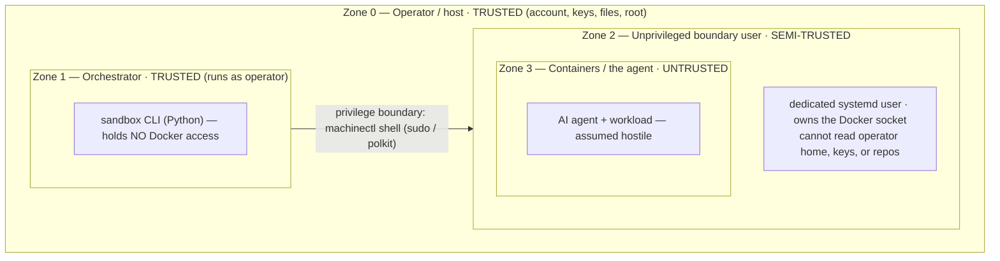
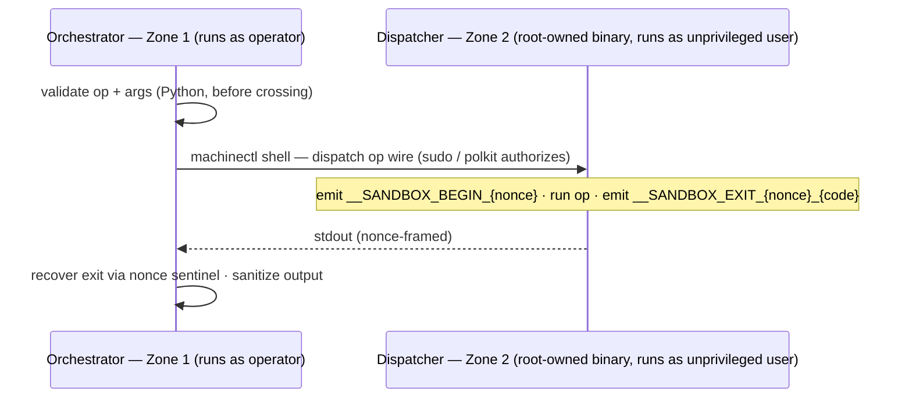
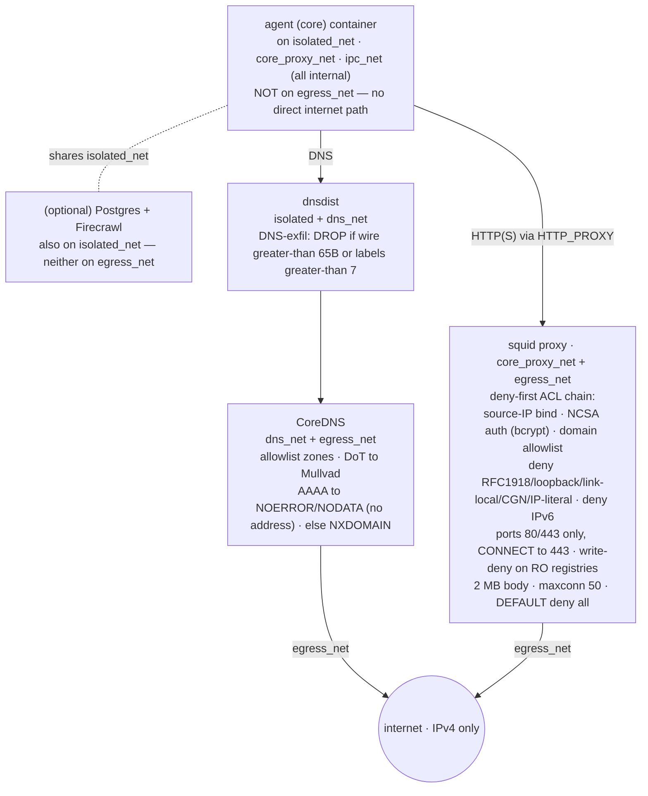

# Security Model

This document describes how `sandbox-ai` isolates an untrusted AI agent from the
operator's host, in enough detail to *review* the claims — not just trust them.
It is the deep-dive companion to the [README threat model](../README.md#threat-model)
and the lean reporting policy in [SECURITY.md](../SECURITY.md). Where a subsystem
has its own reference doc, this page links to it rather than duplicating.

Everything here describes the implementation as it actually is, including its
**deliberate limits**. A security tool that hides its limits is marketing; the
limitations sections below are load-bearing.

---

## 1. The trust model

`sandbox-ai` recognizes four trust zones. The whole design exists to keep the
agent in the innermost zone from reaching the outermost.

- **Zone 0 (operator/host) — trusted by assumption.** A compromised host or a
  malicious operator is out of scope.
- **Zone 1 (orchestrator) — trusted, runs as the operator, but deliberately
  powerless over Docker.** It never executes a Docker call directly; it can only
  *ask* Zone 2 to, across the boundary.
- **Zone 2 (unprivileged boundary user) — semi-trusted.** It owns the Docker
  socket and runs the containers, but it is an unprivileged systemd user with no
  access to the operator's home, SSH keys, or unrelated files.
- **Zone 3 (containers/agent) — untrusted.** This is the threat. Everything
  below is about what stops Zone 3 from reaching Zones 0–2.

---

## 2. The privilege boundary (Zone 1 → Zone 2)

Full reference: [docs/privilege-boundary.md](privilege-boundary.md) and
[docs/dispatcher.md](dispatcher.md).

**Core invariant: the orchestrator never runs Docker as the operator.** Every
orchestrator→sandbox *runtime* operation crosses into the unprivileged boundary
user via `machinectl shell`, authorized by either `sudo` or `polkit` (selected
per host config). The operator-side process holds no Docker access of its own.

How a crossing works:

Key properties:

- **Fixed, enumerated op surface — 10 ops, no free-form passthrough.** The
  dispatcher exposes exactly: `auth-probe`, `compose-up`, `compose-down`,
  `compose-ps`, `compose-ls`, `docker-version`, `docker-info`,
  `docker-manifest-inspect`, `helper-chown-files`, `helper-mkdir-chown-dirs`.
  Adding an op requires changing source on both sides — it is not data-driven.
- **Arguments are validated before the crossing**, and the compose *verb* is
  hard-coded per op (never taken from the wire), so the crossed payload cannot be
  steered into an arbitrary Docker command.
- **Unforgeable exit recovery.** `machinectl shell` does not propagate the inner
  command's exit code, so the dispatcher frames its run with a random nonce
  (`__SANDBOX_BEGIN_<nonce>` … `__SANDBOX_EXIT_<nonce>_<code>`). Untrusted op
  output cannot forge the trailer because it cannot learn the nonce, which is
  emitted *before* the op runs.
- **Binary-location / integrity split.** The operator-side `sandbox` CLI is
  pip-installed and operator-owned; the dispatcher binary lives at a fixed
  root-owned path (`/usr/local/libexec/sandbox-ai/dispatch`, immutable-bit
  protected). `pip` has no root, so a wheel-shipped dispatcher would be
  operator-writable and defeat the integrity model — hence the split.

### Limitations (privilege boundary)

- **The boundary is orchestrator→user, not user→root, and not in-container.** The
  Zone 2 user owns the Docker socket and can spawn containers; the boundary does
  not claim to stop a Docker-socket-level action by Zone 2. It stops Zone 1 from
  *being* Zone 2 implicitly, and keeps Zone 2 off the operator's files.
- **Integrity rests on the dispatcher binary being trustworthy.** A
  root-owned + immutable-bit binary is the compensating control; a host that can
  rewrite that binary is already Zone 0-compromised (out of scope).
- **The Go dispatcher trusts the orchestrator's argument validation** (it does
  not re-validate). A compromised Zone 1 (e.g. a malicious dependency) is a
  Zone 0/1 trust failure, not something the wire validation defends.
- **One non-runtime path skips PAM.** The flow above covers runtime ops. The
  one-time dispatcher *build* (`compile_dispatcher`) crosses via
  `systemd-run --pipe` instead of `machinectl shell` — a polkit-authorized,
  operator-initiated step that does not invoke PAM. It is not an agent-reachable
  path.

---

## 3. Network isolation (deny-by-default egress)

**Default posture: the agent container has zero direct internet access.** It is
attached only to *internal* Docker networks; all outbound traffic is forced
through an authenticated, allowlisting proxy, and all DNS through a filtering
resolver chain. Nothing is reachable until it is explicitly allowlisted.

### Network topology

Each instance is assigned five consecutive `/24` subnets (drawn from the
`10.100.0.0`–`10.255.255.0` range); only two services (the proxy and CoreDNS)
touch the one network that reaches the internet.

The five subnets: `isolated` (intra-sandbox), `core_proxy` (agent↔proxy),
`dns` (resolver chain), `egress` (the only internet-facing network — proxy +
CoreDNS only), `ipc` (admin↔core). All networks except `egress_net` are
`internal: true` with IP-masquerade disabled; `egress_net` has IPv6 disabled.
When enabled, the optional **Postgres** and **Firecrawl** services also sit on
`isolated_net` (Firecrawl additionally on `core_proxy_net`/`dns_net`); like the
agent, neither reaches `egress_net` — Firecrawl's own web fetches traverse the
same authenticated proxy, restricted to safe methods.

### Egress proxy (squid)

Outbound HTTP/HTTPS is allowed only if the request passes the full ACL chain,
evaluated deny-first, terminating in `http_access deny all`:

- **Authenticated** — NCSA basic auth against a per-instance bcrypt htpasswd.
- **Source-bound** — only the agent's proxy IP (and, if enabled, Firecrawl's,
  restricted to safe methods).
- **Domain-allowlisted** — destination must be in the generated
  `allowed_domains.txt`; everything else is a 403.
- **Anti-SSRF / anti-rebinding** — RFC1918, loopback (127/8), link-local
  (169.254/16), and CGN (100.64/10) destinations are denied *after* DNS
  resolution (`dst` ACLs, no `-n`), and dotted-decimal IP-literal hostnames are
  denied by regex *before* resolution.
- **Tunneling restricted** — only ports 80/443 are permitted, and `CONNECT` is
  allowed only to 443.
- **IPv6 eliminated**, HTTP→HTTPS auto-redirect, `request_body_max_size 2 MB`,
  `maxconn 50`, and write methods (POST/PUT/PATCH/DELETE) denied against
  read-only registry domains.

### DNS chain (dnsdist → CoreDNS)

The agent's resolver is `dnsdist`, which **drops** queries that exceed its
DNS-exfiltration limits (wire length > 65 bytes, or > 7 labels) before
forwarding to CoreDNS. CoreDNS answers only allowlisted zones and forwards
upstream over **DNS-over-TLS** (Mullvad). An `AAAA` (IPv6) lookup of an
allowlisted name returns an empty `NOERROR`/NODATA answer — no address — and any
non-allowlisted name returns `NXDOMAIN`.

### Limitations (network)

- **Proxy auth is per-container-IP, not per-process.** All processes in the
  agent container share one credential; a compromised agent process can read it
  from its environment and use the proxy within the allowlist.
- **Allowlisted domains accept writes unless also marked read-only.** Method
  restriction (no POST/PUT/PATCH/DELETE) applies only to domains listed as
  read-only registries; other allowlisted domains accept write methods.
- **DNS-rebinding defense depends on the local resolver's integrity.** The
  post-resolution RFC1918 `dst` ACLs catch rebinding, but poisoning the
  instance's own `dnsdist` cache is a theoretical bypass.
- **No custom seccomp profile.** Kernel-surface reduction relies on the gVisor
  runtime (§4), not a bespoke seccomp policy.

---

## 4. Container hardening

The core services (core, proxy, coredns, dnsdist, admin) share a hardening
baseline (a Compose YAML anchor) and run on the **gVisor (`runsc`) runtime**,
which interposes a user-space kernel between the container and the host kernel.
The two *optional* services (Postgres, Firecrawl) are hardened independently of
the anchor — see the limitations below.

**Shared baseline (all services):** `cap_drop: ALL`, `no-new-privileges: true`,
`read_only: true` rootfs, `ipc: private`, `init: true`, plus per-service tmpfs
mounts (`noexec,nosuid,nodev` where applicable), `pids_limit`, and memory/CPU
caps.

| Service | Runtime | Caps added | User | Networks | Notable |
|---|---|---|---|---|---|
| **core** (agent) | runsc | `CHOWN` | host UID (≈1000) | isolated, core_proxy, ipc | **`no-new-privileges: false`** (see below); `group_add` workspace bridge gid |
| **proxy** (squid) | runsc | `SETUID`, `SETGID` | 13:13 | core_proxy, egress | privilege-drop to unpriv squid user |
| **coredns** | runsc | `NET_BIND_SERVICE` | 65532:65532 | dns, egress | binds :53 |
| **dnsdist** | runsc | `NET_BIND_SERVICE` | pdns:pdns | isolated, dns | mem/cpu capped |
| **admin** | runsc | none | 65534:65534 | ipc (only) | scratch image; higher resource caps |
| **helper** (disposable) | **runc** | `CHOWN`, `DAC_OVERRIDE` | 0:0 (userns-mapped) | **none** | `--read-only`, `--rm`, tmpfs `/tmp` only |

The helper is the one container on `runc` rather than gVisor; that is acceptable
because it has no network (`--network=none`), a read-only rootfs, runs `--rm`,
and only performs operator-initiated `chown`/`mkdir` operations.

**User-namespace isolation.** Containers run under a userns subuid/subgid
mapping; the disposable helper deliberately does **not** use `--userns=host`. The
helper receives host-absolute uid/gid and translates to in-container ids before
`chown`, so on-disk ownership lands correctly while the isolation envelope is
preserved.

### Limitations (container hardening)

- **Shared kernel.** Containers (even under gVisor) share the host kernel. A
  kernel or runtime 0-day escape is out of scope — gVisor reduces but does not
  eliminate kernel attack surface, and is itself not infallible.
- **The `core` agent container runs `no-new-privileges: false`.** This is a
  deliberate trade-off required for non-root `sshd` PTY allocation (interactive
  agent sessions). It permits setuid/exec privilege transitions *inside the
  agent container* — narrower than the other services, and an honest weakening
  of the baseline for that one container.
- **`read_only` rootfs does not make tmpfs/bind mounts read-only.** Writable
  tmpfs (`/tmp`) and RW workspace mounts still allow code to be written and run
  inside the container.
- **`admin`/`core` carry higher resource caps** (intended — they are the
  workload containers), which is a larger DoS surface than the DNS/proxy
  services.
- **The optional extras are hardened off-anchor.** `db-postgres` and
  `mcp-firecrawl` do not inherit the shared baseline anchor; each re-declares a
  subset (`cap_drop: ALL`, `no-new-privileges: true`, `read_only: true`,
  `runsc`). This is drift-prone, and **Firecrawl omits `ipc: private`** (it stays
  in the default IPC namespace) — notable because Firecrawl is the service that
  fetches attacker-influenced web content. **Postgres uses a persistent
  read-write named volume** (`db-postgres-data`), so agent-influenced database
  state survives an ordinary `stop` (cleared only by the volume-removing
  `stop --clean` / `down -v` path).

---

## 5. Filesystem & ACL isolation (Zone 2 ↔ host files)

Full reference: [docs/acl-model.md](acl-model.md).

**Default posture: the unprivileged boundary user has zero access to the
instance tree.** Every instance directory is created mode `0700`, owned by the
operator. The boundary user (and thus the Docker daemon) gets access *only*
through explicit POSIX ACL entries, on a lifecycle:

- **Pattern A — granted at `start`, revoked at `stop`.** Named ACL entries on
  the instance root, `docker/`, `config/`, `secrets/`, and per-workspace
  effective entries. Mode bits stay `0700`; the named entries are the sole grant.
- **Pattern B — granted once, never revoked.** Ancestor-directory traverse
  (`--x`) so the daemon can reach the instance dir, the workspace shared-group
  state, and cache/log leaf ownership (subuid `chown`). These are structural
  prerequisites, preserved across stop/start.

**Workspaces** live under `~/.sandbox-ai/workspaces/<inst>/<name>/` and are
bind-mounted **read-write** into the agent at `/workspaces/<name>`. Shared
read/write between the operator, the daemon, and the agent is achieved without
ownership transfer via a **workspace bridge group** (`chgrp` + `chmod 2770`
setgid + ACLs + the container's `--group-add`), which the operator provisions
out-of-band (`groupadd` / `usermod`).

### Limitations (filesystem/ACL)

- **The ACL model protects *host-level* access, not *in-container* access.**
  Workspaces are mounted RW; the agent has full read/write to whatever is mounted
  into it. ACLs stop the boundary user from reaching files *outside* the
  instance tree; they do not constrain the agent within its mounts.
- **`.sandbox.env`'s read ACL is persistent**, not start/stop-scoped: the named
  daemon-read entry is granted at first start and removed only by `destroy`.
- **Workspace shared-group preparation is best-effort.** Files inside a workspace
  not owned by the operator (e.g. left by a prior failure or external tool) are
  skipped during recursive `chgrp`/`chmod`; the tree may be partially prepared
  (a warning is printed).
- **No inter-instance subuid isolation is enforced by this layer** — it assumes
  the host's `/etc/subuid`/`/etc/subgid` ranges are sane and disjoint.

---

## 6. Secrets & state

**Default posture: secrets are protected at rest by file permissions (DAC +
ACLs), not by environment isolation.**

| Secret | Origin | At rest |
|---|---|---|
| `CORE_ANTHROPIC_API_KEY`, `CORE_GITHUB_TOKEN` | operator (prompted, hidden input) | `.sandbox.env`, mode `0600` |
| `PG_PASSWORD` (if Postgres enabled) | auto-generated (`secrets.token_urlsafe(32)`) | `.sandbox.env`, mode `0600` |
| `FIRECRAWL_API_KEY` (if enabled) | operator (prompted) | `.sandbox.env`, mode `0600` |
| Proxy password | generated fresh each `start` | bcrypt htpasswd (`0640`) **and** plaintext in the rendered `compose.yml` (`0640`) |
| IPC SSH keys (Ed25519) | generated at start | `secrets/*`, mode `0600` |

- `.sandbox.env` is created atomically (`O_CREAT|O_EXCL`, mode `0600`) and
  persists across start/stop; `.sandbox.env` and `*.htpasswd` are in
  `.gitignore`.
- Secrets are **never** logged, printed, or passed as subprocess argv; operator
  prompts use hidden input. The instance registry stores only paths +
  timestamps (fcntl-locked), no secrets.
- Secrets reach containers via Compose `env_file` / `environment:` and (for SSH
  keys) read-only bind mounts.

### Limitations (secrets) — read these carefully

- **No environment isolation.** Secrets injected as environment variables are
  visible in `/proc/<pid>/environ` to the in-container agent and to host root.
  The protection is on the *files* (`.sandbox.env`, htpasswd, keys), not on the
  container environment. Do not assume a compromised agent cannot read the
  secrets handed to its own container.
- **The proxy password is persisted to disk in plaintext** inside the rendered
  `docker/compose.yml` (mode `0640`, daemon-readable via ACL). It is *not*
  ephemeral; it is protected by DAC, not by absence-from-disk.
- **Secrets are plaintext at rest** — there is no secrets-manager integration or
  encryption-at-rest; the controls are file permissions and the privilege
  boundary.
- **SSH host-key regeneration** (after manual deletion) will break a cached
  `known_hosts` for `sandbox attach` — a key-rotation limitation, not a leak.

---

## 7. Threat model summary

**Assumes:**

- A single-tenant Linux host with systemd (`machinectl`) and Docker, run by a
  trusted operator who performs the one-time `sudo sandbox setup`.
- The host kernel, systemd, container runtime, and gVisor are not already
  compromised.
- `/etc/subuid` / `/etc/subgid` are sanely configured.

**Defends against:**

- An agent reading/exfiltrating the operator's host credentials, SSH keys, cloud
  config, or unrelated files (Zone 2 has no access to the operator's home; the
  instance tree is ACL-gated).
- An agent escalating to host root *through the orchestrator* (the orchestrator
  never runs Docker as the operator; the only path is the unprivileged boundary
  user; the dispatcher op surface is fixed and validated).
- Uncontrolled network egress and DNS exfiltration (deny-by-default authenticated
  allowlist proxy; filtering DNS-over-TLS resolver chain; anti-SSRF/rebinding
  denies; IPv6 eliminated).
- Cross-project contamination (per-instance subnets, state, workspaces, ACLs).
- Casual secret disclosure (file-permission + ACL protection; secrets never
  logged or passed as argv; `.gitignore` coverage).

**Does NOT defend against:**

- A host **kernel or container-runtime 0-day** escape (shared kernel; gVisor
  reduces, does not eliminate).
- A **compromised or malicious operator/host**, or a compromised orchestrator
  dependency (Zone 0/1 trust).
- **In-container** activity within the agent's own mounts/environment (RW
  workspaces; env-var secrets visible in-container).
- **Dependency / supply-chain** compromise of what the agent or build pulls in.
- Resource exhaustion / **abuse amplification** beyond configured limits.

See [SECURITY.md](../SECURITY.md) for the full known-limitations + roadmap and
the vulnerability-reporting process.

---

## 8. Where to read more

- [docs/privilege-boundary.md](privilege-boundary.md) — the boundary internals,
  `machinectl_cmd`/`pipe_cmd`, PTY/PAM consequences.
- [docs/dispatcher.md](dispatcher.md) — the dispatcher op reference.
- [docs/acl-model.md](acl-model.md) — the ACL/ownership taxonomy.
- [docs/configuration.md](configuration.md) — host and instance config scopes.
- [docs/architecture.md](architecture.md) — the `src/core/` module map.
