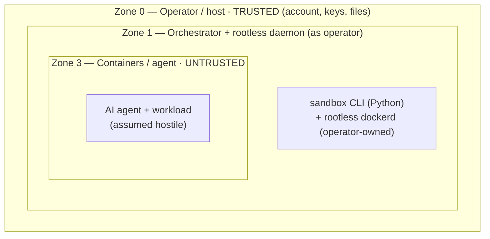
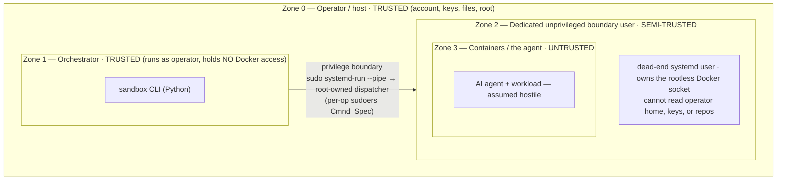
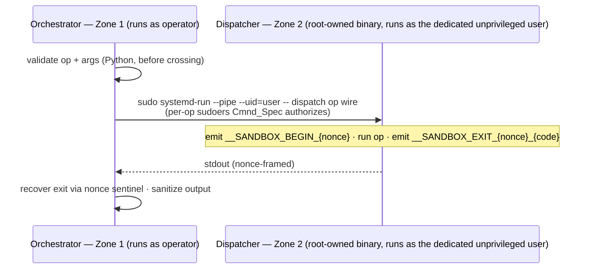
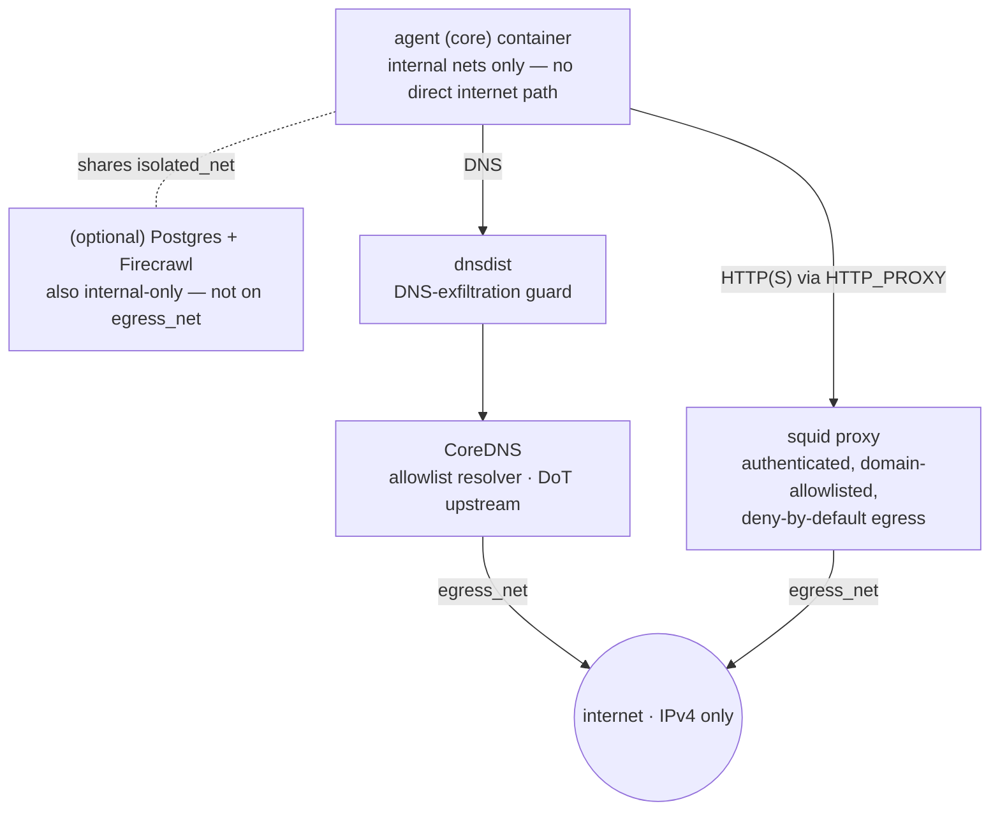

# Security Model

This document describes how `sandbox-ai` isolates an untrusted AI agent from the operator's host, in enough detail to *review* the claims — not just trust them. It is the deep-dive companion to the [README threat model](../README.md#threat-model) and the lean reporting policy in [SECURITY.md](../SECURITY.md), linking to each subsystem's own reference doc rather than duplicating it, and describing the implementation as it actually is — including its **deliberate limits**. A security tool that hides its limits is marketing; the limitations sections below are load-bearing.

## Contents

- [1. The foundation — mode-invariant isolation](#1-the-foundation--mode-invariant-isolation)
- [2. The two execution modes & the trust model](#2-the-two-execution-modes--the-trust-model)
- [3. The privilege boundary (`separate-user` mode)](#3-the-privilege-boundary-separate-user-mode)
- [4. Network isolation (deny-by-default egress)](#4-network-isolation-deny-by-default-egress)
- [5. Container hardening](#5-container-hardening)
- [6. Filesystem & ACL isolation (host files)](#6-filesystem--acl-isolation-host-files)
- [7. Secrets & state](#7-secrets--state)
- [8. Threat model summary](#8-threat-model-summary)
- [9. Where to read more](#9-where-to-read-more)

---

## 1. The foundation — mode-invariant isolation

Almost all of `sandbox-ai`'s isolation is **mode-invariant** — it holds identically in the default `operator-rootless` mode and the opt-in hardened `separate-user` mode (§2), so read this section as "what you get in **both** modes." **The separate-owner privilege crossing of `separate-user` mode is an *increment* on this load-bearing common foundation, not its substitute.**

- **The Docker daemon is rootless in both modes.** A container escape that reaches
  the daemon lands on an **unprivileged uid**, never host root. (The one documented
  exception — an operator-rootless daemon owned by a *sudoer* — is the
  informed-tradeoff WARN in §2/§3.)
- **Agent containers run under the gVisor (`runsc`) runtime** (§5), which
  interposes a user-space kernel between the container and the host kernel. *(The
  one exception is the disposable helper container, which uses `runc` by design —
  see §5.)*
- **User-namespace (subuid/subgid) mapping** isolates in-container uids from host
  uids; container root maps to an unprivileged subuid range, not host root.
- **Egress is deny-by-default** (§4): the agent has no direct internet path; all
  HTTP/HTTPS goes through an allowlisting authenticated proxy and all DNS through a
  filtering DNS-over-TLS resolver chain.
- **Per-instance network isolation** (§4): each instance gets five `/24` bridge subnets,
  four of them `internal: true`; only the fifth (`egress_net`) reaches the internet, and
  only the proxy and CoreDNS attach to it.
- **Container hardening baseline** (§5): `cap_drop`, `no-new-privileges`, read-only
  rootfs on the agent services.
- **Filesystem / ACL isolation** (§6): the instance tree is mode `0700`,
  operator-owned, exposed to the daemon only through explicit, lifecycle-scoped
  POSIX ACL entries.
- **Secrets handling** (§7): secrets are protected at rest by file permissions
  (DAC + ACLs); never logged, printed, or passed as subprocess argv.

The rest of this document presents the two modes (§2–3), then walks the
mode-invariant subsystems in detail (§4–7).

---

## 2. The two execution modes & the trust model

`sandbox-ai` runs in one of two modes, chosen at `sudo sandbox setup` time. The
mode is **not** a user-editable config field — it is setup-determined
and recorded in a root-owned per-operator marker.

- **`operator-rootless` — the default.** Rootless Docker runs as the **invoking
  operator's own user**. Orchestrator→daemon operations run as **local
  subprocesses with no boundary crossing**. The right fit for the common case: a
  single-operator developer box.
- **`separate-user` — opt-in hardened.** Rootless Docker runs as a **dedicated,
  unprivileged `docker_unprivileged_user`** — a dead-end account with no access to
  the operator's home, keys, or repos. Every orchestrator→daemon operation
  **crosses a privilege boundary** into that user via a root-owned Go dispatcher.
  The mode for adversarial-agent and multi-tenant threat models.

`operator-rootless` is the system-wide provisioning default. Full mechanism detail
is in [docs/privilege-boundary.md](privilege-boundary.md).

### Trust zones

`sandbox-ai` recognizes a set of trust zones; the whole design exists to keep the
agent in the innermost zone from reaching the outermost. The middle zone differs
by mode, which is why the diagram has two variants.

**`operator-rootless` (default):** there is no separate boundary user — the daemon
runs as the operator, and ops are local subprocesses.

*No Zone 2 in this mode — the dedicated boundary user exists only in `separate-user` (next diagram), so `operator-rootless` jumps Zone 1 → Zone 3. Containment is the message: the agent (Zone 3) is held inside Zone 1 by the mode-invariant foundation — gVisor + userns + deny-by-default egress (§4–§5).*

**`separate-user` (opt-in hardened):** a dedicated, dead-end boundary user owns the
daemon; the orchestrator holds no Docker access and can only *ask* across the
privilege boundary.

- **Zone 0 (operator/host) — trusted by assumption.** A compromised host or a
  malicious operator is out of scope.
- **Zone 1 (orchestrator).** In `operator-rootless` it runs as the operator and
  *owns* the rootless daemon. In `separate-user` it is deliberately powerless over
  Docker — it never runs a Docker call directly; it can only *ask* Zone 2 to,
  across the boundary.
- **Zone 2 (dedicated boundary user) — `separate-user` only.** A dead-end,
  unprivileged systemd user that owns the rootless Docker socket but has no access
  to the operator's home, SSH keys, or unrelated files.
- **Zone 3 (containers/agent) — untrusted.** This is the threat. Everything below
  is about what stops Zone 3 from reaching the outer zones.

### The operator-rootless sudoer-owner tradeoff (honest does-NOT-defend)

- **What it is.** Because the rootless daemon in `operator-rootless` is owned by the operator's own user, if that operator is a **sudoer**, a (rare, gVisor-fronted) escape that reaches the daemon owner could `sudo` → root — re-enlarging the blast radius the `separate-user` dead-end account would otherwise shrink.
- **Why it is a WARN, not a FAIL.** `sandbox doctor`'s `daemon_owner_sudo` check surfaces it (gated to operator-rootless) as an **informed-tradeoff WARN, never a FAIL**. The escape is gated behind gVisor (it must be defeated first), so this is a tradeoff for hardened deployments to weigh, not a misconfiguration.
- **The two named remedies.** (a) Run sandboxes as a dedicated **non-sudo** operator account, or (b) switch to **`separate-user`** mode.
- **Why `separate-user` is exempt.** `separate-user` has **no** equivalent warning, because its daemon user is a dead-end account.

---

## 3. The privilege boundary (`separate-user` mode)

Full reference: [docs/privilege-boundary.md](privilege-boundary.md) and
[docs/dispatcher.md](dispatcher.md). **This section applies to `separate-user`
mode only** — in `operator-rootless` there is no crossing; ops are local
subprocesses.

**Core invariant (separate-user): the orchestrator never runs Docker as the
operator.** Every orchestrator→sandbox *runtime* operation crosses into the
dedicated boundary user via **`sudo systemd-run --pipe`** (`sudo_pipe_cmd`),
authorized by a **per-op sudoers `Cmnd_Spec`**. The operator-side process holds no
Docker access of its own.

How a crossing works:

Key properties:

- **Fixed, enumerated op surface — 12 ops, no free-form passthrough.** The
  dispatcher exposes exactly: `auth-probe`, `compose-up`, `compose-down`,
  `compose-ps`, `compose-ls`, `docker-version`, `docker-info`,
  `docker-manifest-inspect`, `helper-chown-files`, `helper-mkdir-chown-dirs`,
  `preflight`, and `fwd`. **Eleven are *framed*** (begin/exit recovery framing);
  **`fwd` alone is *streaming*** (raw byte stream, no framing — see §3.1). Adding
  an op requires changing source on both sides — it is not data-driven.
- **Arguments are validated before the crossing**, and the op verb (e.g. the
  compose `up -d --build --wait` / `down` verb) is **hard-coded per op** (never
  taken from the wire), so the crossed payload cannot be steered into an arbitrary
  Docker command.
- **Unforgeable, dispatcher-emitted exit recovery.** The crossing does not
  propagate the inner command's exit code, so the dispatcher frames its run with a
  random nonce (`__SANDBOX_BEGIN_<nonce>` … `__SANDBOX_EXIT_<nonce>_<code>`),
  emitted *after* sudo authorizes the crossing. Untrusted op output cannot forge
  the trailer because it cannot learn the nonce, which is emitted *before* the op
  runs.
- **Binary-location / integrity split.** The operator-side `sandbox` CLI is
  pip-installed and operator-owned; the dispatcher binary lives at a fixed
  root-owned path (`/usr/local/libexec/sandbox-ai/dispatch`, immutable-bit
  protected). `pip` has no root, so a wheel-shipped dispatcher would be
  operator-writable and defeat the integrity model — hence the split.

### 3.1 Attach & the streaming `fwd` op — residual exposure

`sandbox attach` connects the operator to the running agent over SSH; the ProxyCommand differs by mode.

- **`separate-user`:** the ProxyCommand crosses via `sudo_pipe_cmd` carrying the streaming **`fwd`** op (`… dispatch fwd <inst> --project 
 --ip <IP>`, which execs `docker exec -i <project>-admin-1 /fwd <core_ipc_ip>:9999`); this lets the per-op sudoers `Cmnd_Spec` authorize it non-interactively, so separate-user attach is **headless-capable**. `fwd` carries a raw byte stream, so it emits no begin/exit framing and execs its target directly.
- **`operator-rootless`:** attach uses the operator-local docker-exec ProxyCommand with no crossing.

These attach residuals are **accepted, documented `does-NOT-defend` caveats — not
fixed**:

- **Undetectable plane-owner MITM is unattainable to fix at this layer.** The ssh
  endpoint lives *inside* the plane the agent controls, so attach cannot promise a
  trustworthy *view* of the sandbox. A sufficiently compromised plane could present
  a doctored view to the attached operator and this layer cannot detect it.
- **What attach *does* guarantee is non-escalation.** The session cannot be used to
  reach back into the operator's host. That is the guarantee — not a trustworthy
  view of the plane (which is unattainable), but that an attach session is not a
  path *out* of the sandbox.
- **Documented residual exposures while attached:** terminal **escape sequences**
  emitted by hostile in-container output; the **tlog-replay hazard** (recorded
  session output replayed into a terminal); and **typed-secret visibility** — a
  secret you type during an attach session is visible to the plane you are attached
  to. Treat an attach session as observed by the (untrusted) sandbox.

### Limitations (privilege boundary)

- **The boundary is orchestrator→user, not user→root, and not in-container** (and
  exists only in `separate-user` mode). The Zone 2 user owns the Docker socket and
  can spawn containers; the boundary does not claim to stop a Docker-socket-level
  action by Zone 2. It stops Zone 1 from *being* Zone 2 implicitly, and keeps
  Zone 2 off the operator's files.
- **In `operator-rootless` there is no boundary user** — isolation rests entirely
  on the mode-invariant foundation (rootless daemon + gVisor + userns + egress
  control), plus the sudoer-owner tradeoff (§2).
- **Integrity rests on the dispatcher binary being trustworthy.** A
  root-owned + immutable-bit binary is the compensating control; a host that can
  rewrite that binary is already Zone 0-compromised (out of scope).
- **The Go dispatcher trusts the orchestrator's argument validation** (it does not
  re-validate). A compromised Zone 1 (e.g. a malicious dependency) is a Zone 0/1
  trust failure, not something the wire validation defends.
- **One non-runtime path skips PAM.** `systemd-run`-based crossings
  (`sudo systemd-run --pipe`, including the one-time dispatcher *build*) do not
  invoke PAM. This is an audited, operator-initiated orchestrator path crossing as
  the unprivileged uid — not an agent-reachable path, and no privilege gain.

---

## 4. Network isolation (deny-by-default egress)

This subsystem is **mode-invariant** — identical in both execution modes.

**Default posture: the agent container has zero direct internet access.** It is
attached only to *internal* Docker networks; all outbound traffic is forced
through an authenticated, allowlisting proxy, and all DNS through a filtering
resolver chain. Nothing is reachable until it is explicitly allowlisted.

### Network topology

Each instance is assigned five consecutive `/24` subnets (drawn from the
`10.100.0.0`–`10.255.255.0` range); only two services (the proxy and CoreDNS)
touch the one network that reaches the internet.

*Only the proxy and CoreDNS touch `egress_net` (the internet); the agent has no direct path out. Each node's full config is in the subnet table + the "Egress proxy" and "DNS chain" subsections below.*

The five subnets (all `internal: true` with IP-masquerade disabled, except `egress` which is the only internet-facing network and has IPv6 disabled):

| Subnet | Purpose | `internal: true`? | Attached services |
|---|---|---|---|
| `isolated` | intra-sandbox | yes | |
| `core_proxy` | agent↔proxy | yes | |
| `dns` | resolver chain | yes | |
| `egress` | the only internet-facing network | no (IPv6 disabled) | proxy + CoreDNS only |
| `ipc` | admin↔core | yes | |

> **Optional services.** When enabled, the optional **Postgres** and **Firecrawl** services also sit on `isolated_net` (Firecrawl additionally on `core_proxy_net`/`dns_net`); like the agent, neither reaches `egress_net` — Firecrawl's own web fetches traverse the same authenticated proxy, restricted to safe methods.

### Egress proxy (squid)

Outbound HTTP/HTTPS is allowed only if the request passes the full ACL chain,
evaluated deny-first, terminating in `http_access deny all`:

- **Authenticated** — NCSA basic auth against a per-instance bcrypt htpasswd.
- **Source-bound** — only the agent's proxy IP (and, if enabled, Firecrawl's,
  restricted to safe methods).
- **Domain-allowlisted** — destination must be in the generated
  `allowed_domains.txt`; everything else is a 403.
- **Anti-SSRF / anti-rebinding** — RFC1918, loopback (127/8), link-local
  (169.254/16), and CGN (100.64/10) destinations are denied *after* DNS
  resolution (`dst` ACLs, no `-n`), and dotted-decimal IP-literal hostnames are
  denied by regex *before* resolution.
- **Tunneling restricted** — only ports 80/443 are permitted, and `CONNECT` is
  allowed only to 443.
- **IPv6 eliminated**, HTTP→HTTPS auto-redirect, `request_body_max_size 2 MB`,
  `maxconn 50`, and write methods (POST/PUT/PATCH/DELETE) denied against
  read-only registry domains.

### DNS chain (dnsdist → CoreDNS)

The agent's resolver is `dnsdist`, which **drops** queries that exceed its
DNS-exfiltration limits (wire length > 65 bytes, or > 7 labels) before
forwarding to CoreDNS. CoreDNS answers only allowlisted zones and forwards
upstream over **DNS-over-TLS** (Mullvad). An `AAAA` (IPv6) lookup of an
allowlisted name returns an empty `NOERROR`/NODATA answer — no address — and any
non-allowlisted name returns `NXDOMAIN`.

### Limitations (network)

- **Proxy auth is per-container-IP, not per-process.** All processes in the
  agent container share one credential; a compromised agent process can read it
  from its environment and use the proxy within the allowlist.
- **Allowlisted domains accept writes unless also marked read-only.** Method
  restriction (no POST/PUT/PATCH/DELETE) applies only to domains listed as
  read-only registries; other allowlisted domains accept write methods.
- **It is an HTTP/HTTPS forward-proxy allowlist** — it does not filter arbitrary
  TCP/UDP. Egress confinement is built on the internal-network topology (no direct
  route off `egress_net`) plus the proxy/DNS chokepoints, not on packet filtering.
- **DNS-rebinding defense depends on the local resolver's integrity.** The
  post-resolution RFC1918 `dst` ACLs catch rebinding, but poisoning the
  instance's own `dnsdist` cache is a theoretical bypass.
- **No custom seccomp profile.** Kernel-surface reduction relies on the gVisor
  runtime (§5), not a bespoke seccomp policy.

---

## 5. Container hardening

This subsystem is **mode-invariant**. The core services (core, proxy, coredns,
dnsdist, admin) share a hardening baseline (a Compose YAML anchor) and run on the
**gVisor (`runsc`) runtime**, which interposes a user-space kernel between the
container and the host kernel. The two *optional* services (Postgres, Firecrawl)
are hardened independently of the anchor — see the limitations below.

**Shared baseline (all services):** `cap_drop: ALL`, `no-new-privileges: true`,
`read_only: true` rootfs, `ipc: private`, `init: true`, plus per-service tmpfs
mounts (`noexec,nosuid,nodev` where applicable), `pids_limit`, and memory/CPU
caps.

| Service | Runtime | Caps added | User | Networks | Notable |
|---|---|---|---|---|---|
| **core** (agent) | runsc | `CHOWN` | host UID (≈1000) | isolated, core_proxy, ipc | **`no-new-privileges: false`** (see below); `group_add` workspace bridge gid |
| **proxy** (squid) | runsc | `SETUID`, `SETGID` | 13:13 | core_proxy, egress | privilege-drop to unpriv squid user |
| **coredns** | runsc | `NET_BIND_SERVICE` | 65532:65532 | dns, egress | binds :53 |
| **dnsdist** | runsc | `NET_BIND_SERVICE` | pdns:pdns | isolated, dns | mem/cpu capped |
| **admin** | runsc | none | 65534:65534 | ipc (only) | scratch image; higher resource caps |
| **helper** (disposable) | **runc** | `CHOWN`, `DAC_OVERRIDE` | 0:0 (userns-mapped) | **none** | `--read-only`, `--rm`, tmpfs `/tmp` only |

The helper is the **one container on `runc` rather than gVisor** — by design. It is
acceptable because the helper has no network (`--network=none`), a read-only
rootfs, runs `--rm`, drops all caps but `CHOWN`/`DAC_OVERRIDE`, and only performs
operator-initiated `chown`/`mkdir` operations over a short lifetime. So "agent
workloads run under gVisor" is true; "everything runs under gVisor" is **not** —
the helper is the deliberate exception.

**User-namespace isolation.** Containers run under a userns subuid/subgid
mapping; the disposable helper deliberately does **not** use `--userns=host`. The
helper receives host-absolute uid/gid and translates to in-container ids before
`chown`, so on-disk ownership lands correctly while the isolation envelope is
preserved.

### Limitations (container hardening)

- **Shared kernel.** Containers (even under gVisor) share the host kernel. A
  kernel or runtime 0-day escape is out of scope — gVisor reduces but does not
  eliminate kernel attack surface, and is itself not infallible.
- **The `core` agent container runs `no-new-privileges: false`.** This is a
  deliberate trade-off required for non-root `sshd` PTY allocation (interactive
  agent sessions). It permits setuid/exec privilege transitions *inside the
  agent container* — narrower than the other services, and an honest weakening
  of the baseline for that one container. (So `no-new-privileges` is **not** blanket
  across every service.)
- **`read_only` rootfs does not make tmpfs/bind mounts read-only.** Writable
  tmpfs (`/tmp`) and RW workspace mounts still allow code to be written and run
  inside the container.
- **`admin`/`core` carry higher resource caps** (intended — they are the
  workload containers), which is a larger DoS surface than the DNS/proxy
  services.
- **The optional extras are hardened off-anchor.** `db-postgres` and
  `mcp-firecrawl` do not inherit the shared baseline anchor; each re-declares a
  subset (`cap_drop: ALL`, `no-new-privileges: true`, `read_only: true`,
  `runsc`). This is drift-prone, and **Firecrawl omits `ipc: private`** (it stays
  in the default IPC namespace) — notable because Firecrawl is the service that
  fetches attacker-influenced web content. **Postgres uses a persistent
  read-write named volume** (`db-postgres-data`), so agent-influenced database
  state survives an ordinary `stop` (cleared only by the volume-removing
  `stop --clean` / `down -v` path).

---

## 6. Filesystem & ACL isolation (host files)

This subsystem is **mode-invariant**. Full reference:
[docs/acl-model.md](acl-model.md).

**Default posture: the daemon owner has zero access to the instance tree.** Every
instance directory is created mode `0700`, owned by the operator. The daemon (the
operator's own user in `operator-rootless`, the dedicated boundary user in
`separate-user`) gets access *only* through explicit POSIX ACL entries, on a
lifecycle:

- **Pattern A — granted at `start`, revoked at `stop`.** Named ACL entries on
  the instance root, `docker/`, `config/`, `secrets/`, and per-workspace
  effective entries. Mode bits stay `0700`; the named entries are the sole grant.
- **Pattern B — granted once, never revoked.** Ancestor-directory traverse
  (`--x`) so the daemon can reach the instance dir, the workspace shared-group
  state, and cache/log leaf ownership (subuid `chown`). These are structural
  prerequisites, preserved across stop/start.

**Workspaces** live under `~/.sandbox-ai/workspaces/<inst>/<name>/` and are
bind-mounted **read-write** into the agent at `/workspaces/<name>`. Shared
read/write between the operator, the daemon, and the agent is achieved without
ownership transfer via a **workspace bridge group** (`chgrp` + `chmod 2770`
setgid + ACLs + the container's `--group-add`), which the operator provisions
out-of-band (`groupadd` / `usermod`).

### Limitations (filesystem/ACL)

- **The ACL model protects *host-level* access, not *in-container* access.**
  Workspaces are mounted RW; the agent has full read/write to whatever is mounted
  into it. ACLs stop the daemon owner from reaching files *outside* the
  instance tree; they do not constrain the agent within its mounts.
- **`.sandbox.env`'s read ACL is persistent**, not start/stop-scoped: the named
  daemon-read entry is granted at first start and removed only by `destroy`.
- **Workspace shared-group preparation is best-effort.** Files inside a workspace
  not owned by the operator (e.g. left by a prior failure or external tool) are
  skipped during recursive `chgrp`/`chmod`; the tree may be partially prepared
  (a warning is printed).
- **No inter-instance subuid isolation is enforced by this layer** — it assumes
  the host's `/etc/subuid`/`/etc/subgid` ranges are sane and disjoint.

---

## 7. Secrets & state

This subsystem is **mode-invariant**.

**Default posture: secrets are protected at rest by file permissions (DAC +
ACLs), not by environment isolation.**

| Secret | Origin | At rest |
|---|---|---|
| `CORE_ANTHROPIC_API_KEY`, `CORE_GITHUB_TOKEN` | operator (prompted, hidden input) | `.sandbox.env`, mode `0600` |
| `PG_PASSWORD` (if Postgres enabled) | auto-generated (`secrets.token_urlsafe(32)`) | `.sandbox.env`, mode `0600` |
| `FIRECRAWL_API_KEY` (if enabled) | operator (prompted) | `.sandbox.env`, mode `0600` |
| Proxy password | generated fresh each `start` | bcrypt htpasswd (`0640`) **and** plaintext in the rendered `compose.yml` (`0640`) |
| IPC SSH keys (Ed25519) | generated at start | `secrets/*`, mode `0600` |

- `.sandbox.env` is created atomically (`O_CREAT|O_EXCL`, mode `0600`) and
  persists across start/stop; `.sandbox.env` and `*.htpasswd` are in
  `.gitignore`.
- Secrets are **never** logged, printed, or passed as subprocess argv; operator
  prompts use hidden input. The instance registry stores only paths +
  timestamps (fcntl-locked), no secrets.
- Secrets reach containers via Compose `env_file` / `environment:` and (for SSH
  keys) read-only bind mounts.

### Limitations (secrets) — read these carefully

- **No environment isolation.** Secrets injected as environment variables are
  visible in `/proc/<pid>/environ` to the in-container agent and to host root.
  The protection is on the *files* (`.sandbox.env`, htpasswd, keys), not on the
  container environment. Do not assume a compromised agent cannot read the
  secrets handed to its own container.
- **The proxy password is persisted to disk in plaintext** inside the rendered
  `docker/compose.yml` (mode `0640`, daemon-readable via ACL). It is *not*
  ephemeral; it is protected by DAC, not by absence-from-disk.
- **Secrets are plaintext at rest** — there is no secrets-manager integration or
  encryption-at-rest; the controls are file permissions and (in `separate-user`)
  the privilege boundary.
- **Typed secrets are visible to an attached plane.** A secret you type into a
  `sandbox attach` session is visible to the (untrusted) sandbox you are attached
  to — see the attach residuals in §3.1.
- **SSH host-key regeneration** (after manual deletion) will break a cached
  `known_hosts` for `sandbox attach` — a key-rotation limitation, not a leak.

---

## 8. Threat model summary

**Assumes:**

- A single-tenant Linux host with systemd and Docker, run by a trusted operator
  who performs the one-time `sudo sandbox setup`. (In `separate-user` mode the
  crossing also relies on `machinectl`/`systemd-run`.)
- The host kernel, systemd, container runtime, and gVisor are not already
  compromised.
- `/etc/subuid` / `/etc/subgid` are sanely configured.

**Defends against:**

- An agent reading/exfiltrating the operator's host credentials, SSH keys, cloud
  config, or unrelated files (the daemon owner has no access to the operator's
  home; the instance tree is ACL-gated).
- An agent escalating to host root *through the orchestrator* — the foundation is
  the **rootless daemon** (an escape lands on an unprivileged uid); in
  `separate-user` mode the orchestrator additionally never runs Docker as the
  operator and the dispatcher op surface is fixed and validated.
- Uncontrolled network egress and DNS exfiltration (deny-by-default authenticated
  allowlist proxy; filtering DNS-over-TLS resolver chain; anti-SSRF/rebinding
  denies; IPv6 eliminated).
- Cross-project contamination (per-instance subnets, state, workspaces, ACLs).
- Casual secret disclosure (file-permission + ACL protection; secrets never
  logged or passed as argv; `.gitignore` coverage).

**Does NOT defend against:**

- A host **kernel or container-runtime 0-day** escape (shared kernel; gVisor
  reduces, does not eliminate).
- In `operator-rootless` mode, a **sudoer daemon owner** escalating after a
  gVisor-fronted escape (informed-tradeoff WARN; §2/§3 — remedied by a non-sudo
  operator or `separate-user` mode).
- A **compromised or malicious operator/host**, or a compromised orchestrator
  dependency (Zone 0/1 trust).
- **In-container** activity within the agent's own mounts/environment (RW
  workspaces; env-var secrets visible in-container).
- A trustworthy **view** of the sandbox while attached — `sandbox attach`
  guarantees **non-escalation** only, not an un-tampered view; **terminal escape
  sequences**, the **tlog-replay hazard**, and **typed-secret visibility** are
  accepted, documented residuals (§3.1).
- **Dependency / supply-chain** compromise of what the agent or build pulls in.
- Resource exhaustion / **abuse amplification**. A sandbox's configured `cpus` /
  `mem_limit` are **render-time-only for gVisor containers under the rootless daemon**
  — not cgroup-enforced (`runsc` runs `--ignore-cgroups` because it cannot create its
  cgroup scope rootless), so a container can exceed them rather than being bounded *at*
  the configured limit. `sandbox doctor` surfaces over-commit as an advisory WARN; this
  is single-tenant resource pressure, not an escape. See
  [SECURITY.md](../SECURITY.md) for the full known-limitation.

See [SECURITY.md](../SECURITY.md) for the full known-limitations + roadmap and
the vulnerability-reporting process.

---

## 9. Where to read more

- [docs/privilege-boundary.md](privilege-boundary.md) — the two modes, the
  boundary internals, the crossing-primitive selection table, PTY/PAM
  consequences.
- [docs/dispatcher.md](dispatcher.md) — the dispatcher op reference (12 ops).
- [docs/acl-model.md](acl-model.md) — the ACL/ownership taxonomy.
- [docs/configuration.md](configuration.md) — host and instance config scopes.
- [docs/architecture.md](architecture.md) — the `src/core/` module map.
